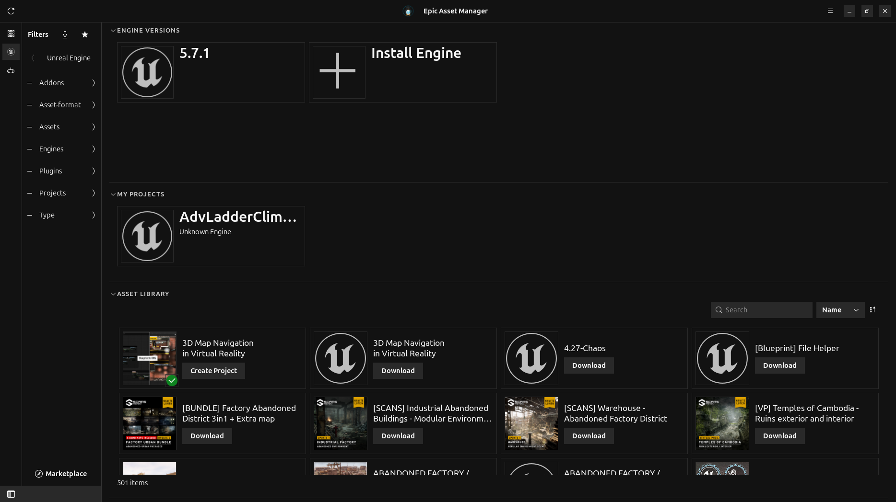
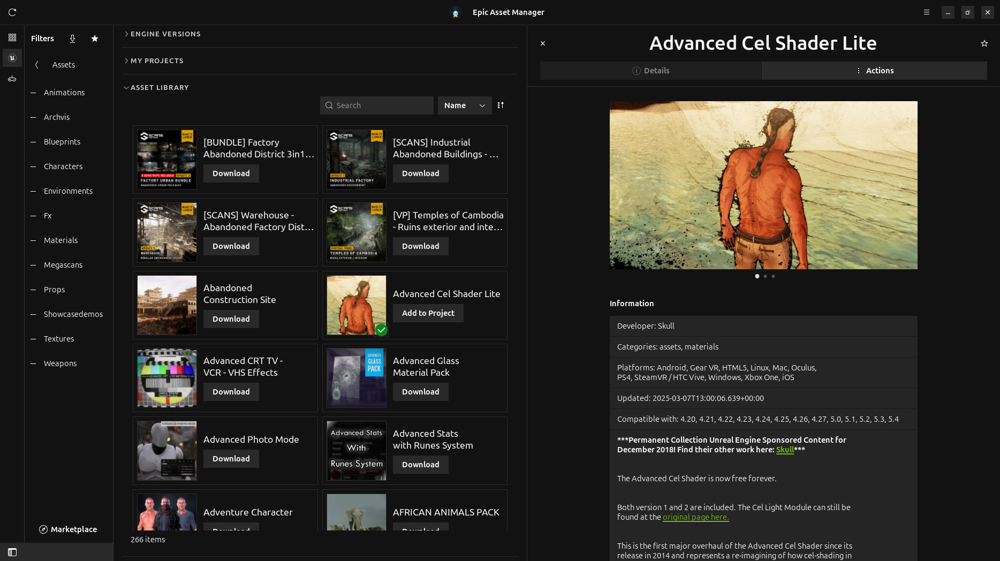
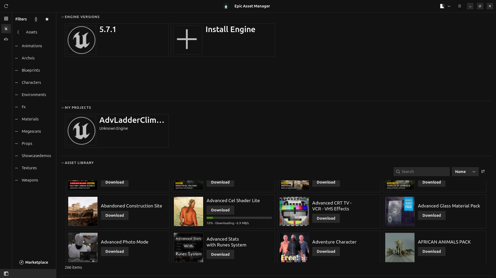
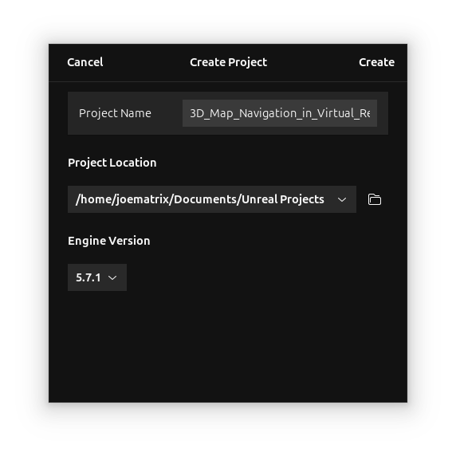
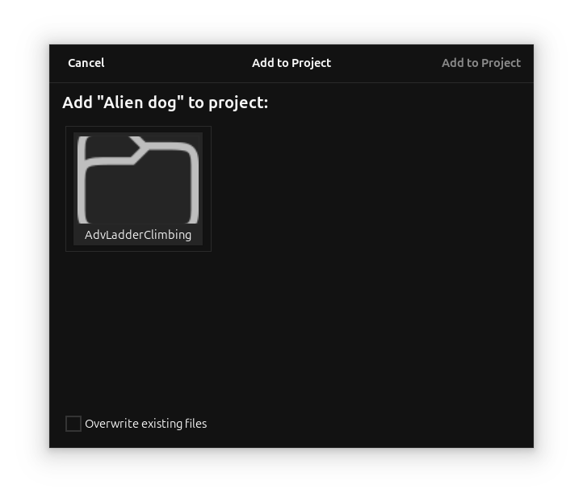

# Epic Asset Manager UI Improvements

## Summary

This PR brings significant UI/UX improvements to Epic Asset Manager, focusing on making the application more functional and visually consistent. Key additions include download progress indicators on asset tiles, a Create Project workflow, and an Add to Project dialog.

## New Features

### 🎮 Asset Tile Improvements
- **Download Progress Bar**: Asset tiles now show a progress bar during downloads, similar to the Windows Epic Games Launcher
- **Download Info Display**: Shows percentage and download speed below the progress bar
- **Action Buttons**: Each tile has a context-aware action button:
  - "Download" for assets not yet downloaded
  - "Create Project" for downloaded project templates
  - "Add to Project" for downloaded assets
- **Click Behavior**: Clicking the tile opens the asset details panel; clicking the button triggers the action

### 📁 Create Project Dialog
- New popup dialog for creating Unreal Engine projects from downloaded assets
- Automatically detects if asset is already downloaded and copies directly (no re-download)
- Launches the `.uproject` file after creation completes
- Shows project templates in a grid view

### ➕ Add to Project Dialog
- New popup dialog to add assets to existing projects
- Shows all projects from the Projects tab as selectable tiles
- Option to overwrite existing files
- Copies asset content to selected project's Content folder

### 🎨 Visual Improvements
- **Square Corners**: All UI elements now have square corners for a more modern look
- **Epic Dark Theme**: Dark theme colors (#121212 background) matching Epic Games Launcher
- **Flat Button Styles**: Header bar and sidebar buttons are flat/borderless
- **UE Penguin Icon**: Added Unreal Engine penguin icon to header bar

## Bug Fixes

- **Preferences Crash**: Fixed crash when opening Preferences (removed unsupported `separate-rows` property for older libadwaita)
- **Application Shutdown**: Fixed proper cleanup on application exit
- **Detail Panel Layout**: Detail panel now spans full height of the window
- **Asset Vault Lookup**: Fixed vault folder lookup to use `release_info.app_id` instead of `asset_info.id`

## Installation Improvements

- Added `install-local.sh` script for easy local development installation
- Launcher script automatically sets `GSETTINGS_SCHEMA_DIR` for proper GSettings access
- Desktop file integration works correctly from app icon launch

## Files Changed

### New Files
- `src/ui/widgets/logged_in/library/actions/add_to_project_dialog.rs`
- `src/ui/widgets/logged_in/library/actions/create_project_dialog.rs`
- `data/resources/ui/logged_in/library/actions/add_to_project_dialog.ui`
- `data/resources/ui/logged_in/library/actions/create_project_dialog.ui`
- `install-local.sh`

### Modified Files
- `src/ui/widgets/logged_in/library/asset.rs` - Added action button, progress bar, click handling
- `src/ui/widgets/logged_in/library/mod.rs` - Added signal handlers, dialog launchers
- `src/models/asset_data.rs` - Added downloading/progress properties
- `src/ui/widgets/download_manager/asset.rs` - Connected download progress to library
- `data/resources/style.css` - Epic dark theme, square corners
- `data/resources/ui/logged_in/library/asset.ui` - Added button and progress bar
- `data/resources/ui/preferences/preferences.ui` - Fixed libadwaita compatibility

## Screenshots

### Main View - Asset Library with Action Buttons

### Asset Details Panel with Add to Project Button

### Download Progress Bar on Asset Tiles
Shows real-time download progress (10% @ 6.9 MB/s) directly on the asset tile.

### Create Project Dialog

### Add to Project Dialog

## Testing

Tested on:
- Ubuntu 24.04
- GTK4 / libadwaita
- Unreal Engine 5.7 projects

## Breaking Changes

None - all changes are additive or visual improvements.

## Notes

- The dark theme uses hardcoded colors (#121212) rather than libadwaita theme variables for consistent Epic Games Launcher styling
- Square corners are enforced via CSS on all UI elements including window decorations
